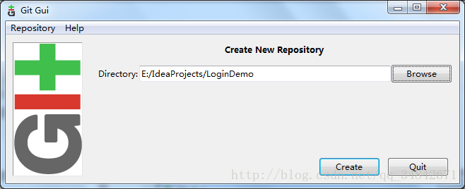
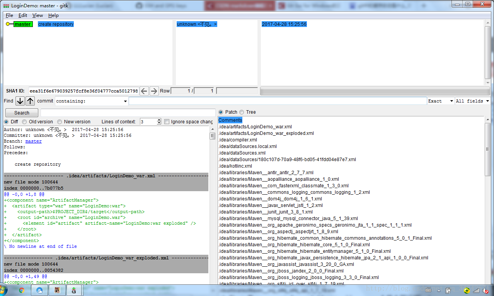
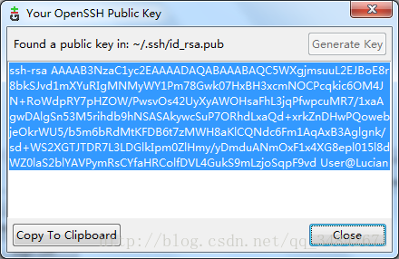
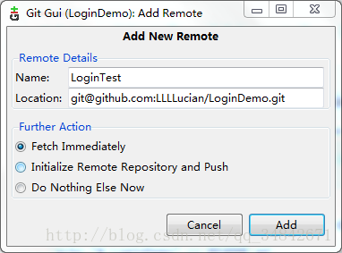
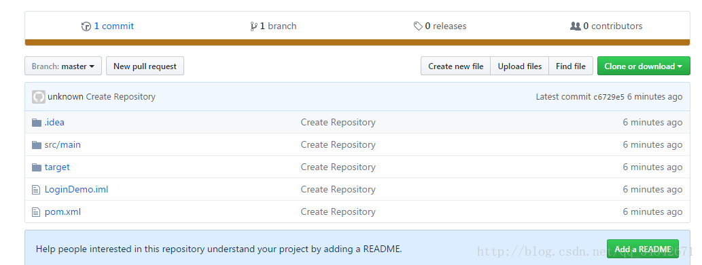
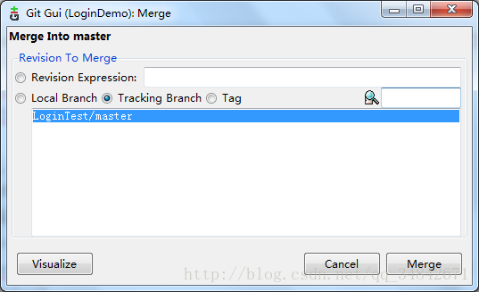
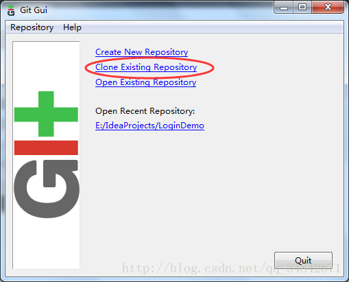

## 1.在本地新建版本库

首先，右键-》Git GUI Here  打开Git GUI，是这样的一个界面，选择第一项，新建版本库。 
 
然后选择你需要进行版本管理的项目路径。 
 
当你创建了版本库的时候，你可以在该项目的路径下看见多了一个.git文件夹（设置了隐藏文件不可见的话看不见） 

在Git Gui中，如果Unstaged Changes（未缓存的改动）中包含文件，则先点击Stage Changed，将未缓存的改动加入缓存，

再点击Commit（提交到本地仓库）；否则需要先点击Rescan扫描项目中进行过改动的文件。注：提交描述必须要填写，不然无法提交。 

提交成功后，我们可以在Repository->Visualize All Branches History中看到我们提交的历史记录（这是提交到本地而不是提交到远程服务器）。

至此，本地版本库就创建成功了。 

## 2.将项目提交到远程

上一步已经使用Git在本地建立起了版本库，然后我们需要将该项目提交到远程服务器以便同事或其他合作者共同参与开发。一般的开源项目使用github作为远程服务器。其实在本地简历版本库后，只需要点击push就可以直接上传。但是我们还没有将本地的Git与github建立联系以及设置安全协议。

首先，我们需要在有一个自己的github帐户，然后在github上新建一个repository，名字也叫做LoginDemo（可以和本地项目名不一样）。 

在Git Gui中，选择Remote->add添加远程服务器，远程服务器信息有两种填写方式，填写https地址或ssh地址，对应github项目的https和ssh地址。

### 1.https地址

这种方式需要输入你的github帐户和密码，意味着通过这种方式你只能够操作自己的项目。 

### 2.ssh地址

这种方式需要进行授权设置，在Git Gui的菜单栏，点击Help->Show SSH key->Generate SSH KEY创建密钥。 

然后在github的Personal settings中添加它，title随意，可以用Home，company等作为标识来区别。 

添加远程服务器信息。 

接下来，我们便可以直接在Git Gui点击push提交至远程客户端，刷新一下github，便可以看到项目已经在repository中了。 

## 3.从远程下载更新

设想多人参与项目开发，每个人都只push到远程，完全不顾其他成员的进度，这样的开发模式无疑是有问题的。我们最好的做法是，每次push到远程的时候，先从远程把目前进度fetch下来，在和自己目前项目进度merge后，再将它push到远程。打开Git Gui，在菜单栏中选择Remote->Fetch from->LoginTest，便可以从远程服务器更新到本地，但是尚未与自己当前项目合并。 

## 4.合并解决冲突

从远程fetch后，选择Git Gui的Merge->Local Merge进行合并，选择Tracking Branch。 

如果本地有一个方法名叫findUser，而远程服务器中该方法的名字改变了，例如变成了findPassword，则合并遇到冲突，可以右键空白部分选择保留本地版本或远程版本进行合并（图中绿色的代码表示冲突部分）。 

## 5.克隆github上的项目到本地

在Git Gui的主界面选择克隆已有版本库。 

Source Location即github中项目的地址，和第二部分（将项目提交到远程）中一样，可以选择https地址或ssh地址，Target Directory是在本地存放该项目的路径。点击Clone，成功从github将项目克隆到本地。 
